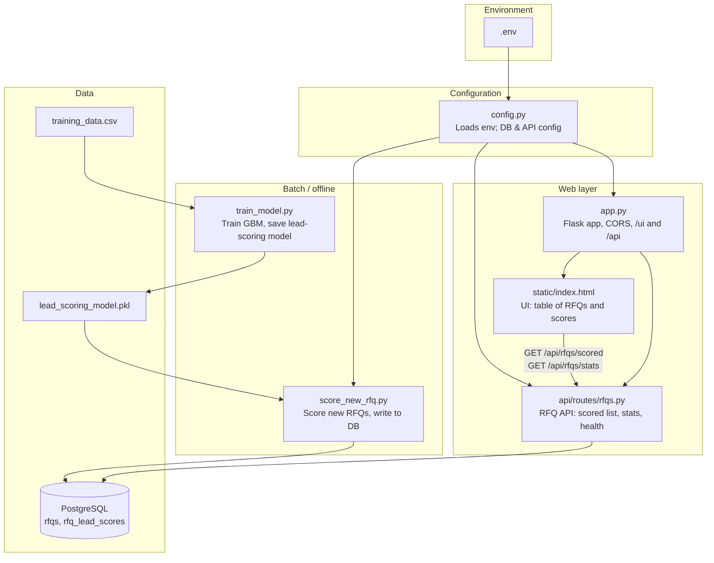
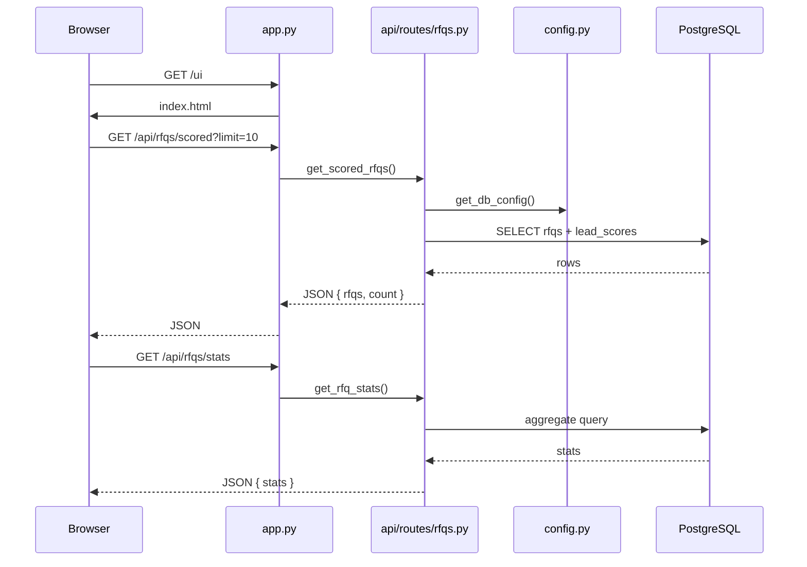
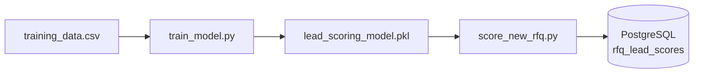

# RFQ-Order-Score — Code Flow Diagram

## Source file summaries (4–5 words)

| File | Summary |
|------|--------|
| `config.py` | Loads env; DB & API config |
| `app.py` | Flask app, CORS, /ui and /api |
| `api/routes/rfqs.py` | RFQ API: scored list, stats, health |
| `static/index.html` | UI: table of RFQs and scores |
| `train_model.py` | Train GBM, save lead-scoring model |
| `score_new_rfq.py` | Score new RFQs, write to DB |

---

## Code flow diagram

---

## Request flow (runtime)

---

## Batch flow (model training & scoring)

- **train_model.py**: Reads CSV → trains GradientBoostingClassifier → saves model + metadata to `.pkl`.
- **score_new_rfq.py**: Loads `.pkl` → queries DB for unscored RFQs → predicts conversion probability → inserts into `rfq_lead_scores`.
